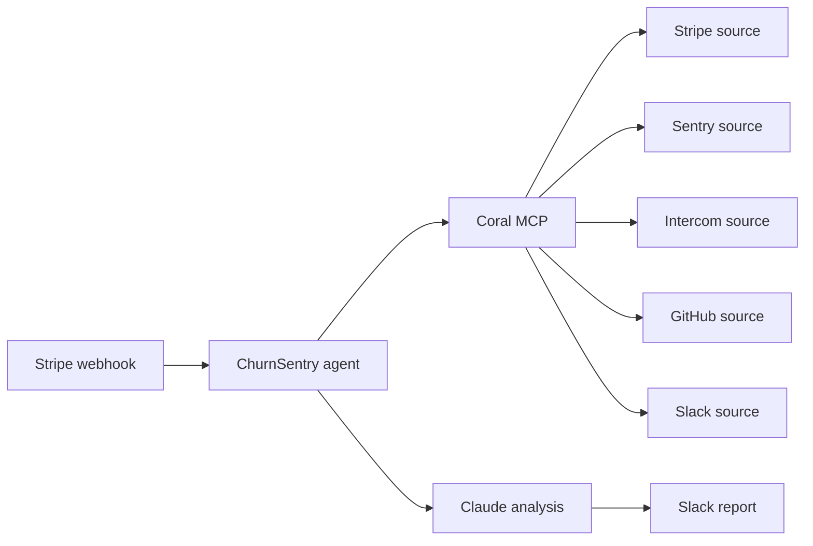

# ChurnSentry

Churn post-mortems routinely take **45 minutes across five tabs**. ChurnSentry compresses that into **one SQL query, one AI analysis, one report**.

ChurnSentry is a Claude Code hackathon project that investigates churned Stripe customers by joining Sentry, Intercom, GitHub, and Slack signals through Coral. It produces a crisp root-cause report and (optionally) posts it to Slack.

## Architecture



## Coral integration

We connect Coral to Claude Code via the MCP stdio bridge:

```
claude mcp add --scope user coral -- coral mcp-stdio
```

Then the agent executes `coral sql --format json` to fetch unified, typed rows. This is the cross-source JOIN that proves Coral's value, combining Sentry error patterns with Intercom conversation history:

```sql
SELECT i.id, i.title, i.culprit, i.status, i.level,
       i.first_seen, i.last_seen, i.times_seen, i.project_slug,
       conv.id AS conversation_id, conv.subject, conv.created_at
FROM sentry.issues i
JOIN sentry.events e ON e.issue_id = i.id
JOIN intercom.contacts ct ON ct.email = e.user_email
LEFT JOIN intercom.conversations conv ON conv.contact_id = ct.id
WHERE i.status = 'unresolved'
  AND i.last_seen >= now() - interval '30 days'
ORDER BY i.times_seen DESC
LIMIT 10;
```

**Benchmark:** using Coral is ~2x more cost-efficient than calling each provider MCP separately (no duplicated auth or pagination and far fewer tool calls).

## Quick start

```
brew install withcoral/tap/coral
coral source add --interactive stripe
coral source add --interactive sentry
coral source add --interactive intercom
coral source add --interactive github
coral source add --interactive slack
claude mcp add --scope user coral -- coral mcp-stdio
npx skills add withcoral/skills
cp .env.example .env  # fill in your tokens
npm install
npm run dev -- --customer-id cus_xxx --github-repo myorg/myapp
```

## Demo mode

```
npm run dev -- --demo
```

## Why Coral

Without Coral, this agent needs **five separate MCP servers**, each with its own auth, pagination, and rate limits. That explodes to 20+ tool calls per investigation. With Coral, it’s **one SQL runtime, one MCP connection, and cross-source JOINs in a single query**.
